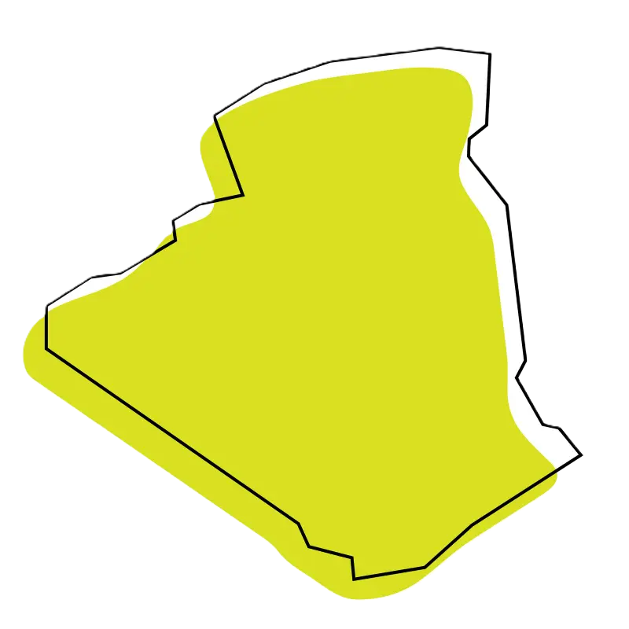

# Substituir geometria

  

  <strong>Substituição segura de geometrias vetoriais no QGIS, com pré-visualização, validação e processamento em lote.</strong>

  
  
  

## Visão geral

**Substituir geometria** é um complemento para QGIS 3 voltado à atualização controlada de geometrias em camadas vetoriais. Ele foi pensado para fluxos cadastrais em que a conferência visual, a associação por identificadores e a segurança antes da gravação são essenciais.

Em vez de alterar uma camada diretamente, o complemento prepara uma prévia das mudanças, valida as correspondências e só grava após confirmação explícita.

## Funcionalidades

- Substituição de uma geometria para um ou vários identificadores.
- Processamento em lote de várias geometrias associadas por atributo.
- Inclusão de múltiplas camadas-alvo na mesma operação.
- Escolha independente do campo identificador de cada camada-alvo.
- Pré-visualização no mapa principal:
  - vermelho: geometria original;
  - verde: geometria nova.
- Painel comparativo antes/depois, com identificação da feição e áreas.
- Reprojeção automática quando origem e destino usam SRCs diferentes.
- Validação de feições ausentes, duplicadas ou com geometria incompatível.
- Exibição dos IDs das feições quando houver pendência.
- Confirmação obrigatória antes de gravar alterações.
- Barra de ferramentas própria, móvel e acoplável.

## Modos de operação

| Modo | Quando usar | Como funciona |
|---|---|---|
| **Uma geometria para vários identificadores** | Quando a camada corrigida não possui RIP ou outro atributo de associação. | Selecione uma geometria de origem e informe os RIPs que devem recebê-la. |
| **Várias geometrias por identificador** | Quando cada geometria corrigida possui um campo como **rip**, código ou identificador equivalente. | O plugin associa cada geometria à feição correspondente em cada camada-alvo. |

> No primeiro modo, sem uma feição selecionada na origem, o plugin usa a primeira feição válida da camada.

## Fluxo de trabalho

~~~text
Camada com geometria(s) corrigida(s)
                ↓
Seleção do modo e dos identificadores
                ↓
Configuração das camadas-alvo e seus campos
                ↓
Prévia e validação das correspondências
                ↓
Comparação visual: original × nova geometria
                ↓
Confirmação e gravação das substituições válidas
~~~

## Instalação

### Pelo arquivo ZIP

1. Baixe ou gere o arquivo **substituir_geometria_qgis.zip**.
2. No QGIS, abra **Complementos > Gerenciar e instalar complementos**.
3. Acesse **Instalar a partir do ZIP**.
4. Selecione o arquivo ZIP e conclua a instalação.
5. Ative o complemento **Substituir geometria**, caso ele não seja ativado automaticamente.

### Manualmente

1. Copie a pasta **substituir_geometria** para:

   ~~~text
   %APPDATA%\QGIS\QGIS3\profiles\default\python\plugins
   ~~~

2. Reinicie o QGIS.
3. Abra **Substituir geometria > Substituir geometria** ou use o ícone na barra de ferramentas do complemento.

## Como usar

1. Escolha o **modo de operação**.
2. Escolha a camada que contém a(s) geometria(s) nova(s).
3. Informe os RIPs ou identificadores:
   - um por linha;
   - separados por vírgula; ou
   - separados por ponto e vírgula.
4. Adicione uma ou mais camadas-alvo.
5. Para cada camada-alvo, escolha o campo que contém o identificador correspondente.
6. Clique em **Atualizar prévia**.
7. Confira a tabela de resultados e selecione uma substituição válida para visualizar a comparação detalhada.
8. Clique em **Aplicar substituições válidas** e confirme a operação.

## Pré-visualização e segurança

O complemento não altera o zoom nem a posição do canvas principal ao atualizar a prévia. A inspeção detalhada acontece nos painéis do próprio plugin:

| Painel | Cor | Informação exibida |
|---|---|---|
| **Original** | Vermelho | Geometria atual, identificador, camada e área. |
| **Nova geometria** | Verde | Geometria que será aplicada e sua área. |

Antes de gravar, o plugin bloqueia associações ambíguas ou incompletas, como:

- identificador ausente na camada-alvo;
- mais de uma geometria de origem para o mesmo identificador;
- mais de uma feição-alvo encontrada;
- geometrias de tipos incompatíveis.

## Requisitos

- QGIS 3.22 ou superior.
- Camadas vetoriais poligonais.
- Permissão de edição nas camadas-alvo.

## Estrutura do projeto

~~~text
.
├── substituir_geometria/
│   ├── __init__.py
│   ├── icone.png
│   ├── metadata.txt
│   └── substituir_geometria.py
├── substituir_geometria_qgis.zip
└── README.md
~~~

## 📩 Contato

👤 **Rogerio Vidal de Siqueira**\
📧 rogeriovidalsiqueira@gmail.com\
🔗 [LinkedIn](https://www.linkedin.com/in/rogerio-vidal-de-siqueira-9478aa136/) | [GitHub](https://github.com/rvidals)

---

> “Com ciência, dados e colaboração, construímos cidades mais resilientes!” 🌱🌏
